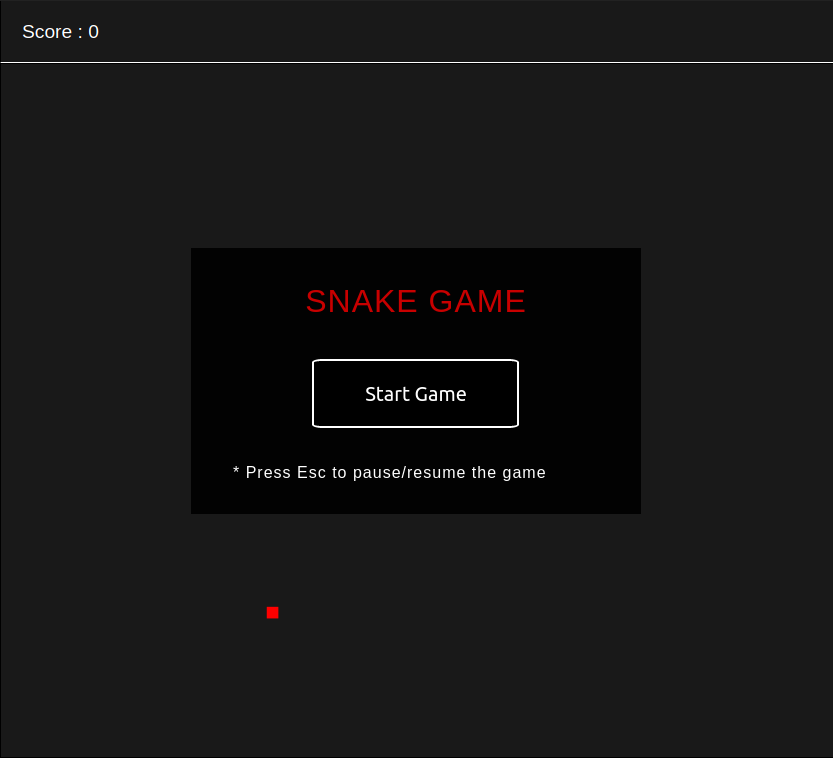
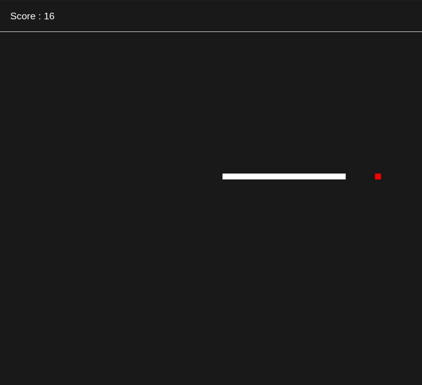

# Snake Game

### A simple snake game using HTML5, CSS3 and JavaScript.

The game can be run by cloning the **Snake-Game** repository into your computer and then opening the **index.html** in your browser would result in the following screen.

 

    

 

The **Start Game** button can be used to start the game. The arrow keys can be used to navigate the snake around the screen to eat it's snack. 

 

    

 

The **Esc** button can be used to pause or resume the game whenever you want to.